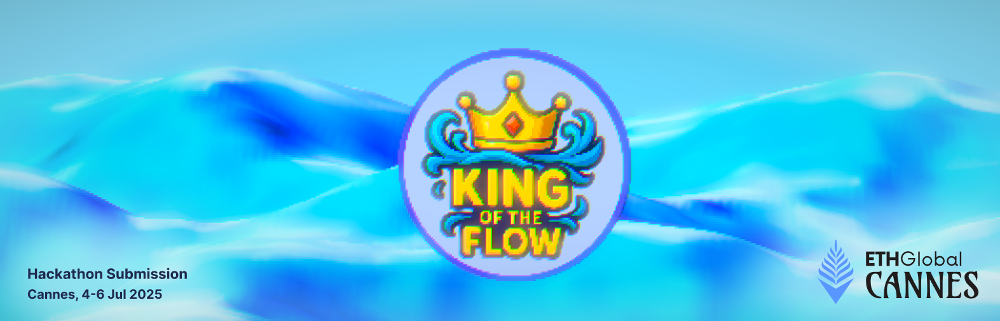

# 👑 King of the Flow

[](https://docs.soliditylang.org/)
[](https://developers.flow.com/build/flow)
[](https://ethglobal.com/)

---



## ✨ Overview

**King of the Flow** is a decentralized "King-of-the-Hill" bidding game deployed on the Flow EVM. Users compete to become the "King" by placing bids in `stFLOW`, a liquid staking derivative of the FLOW token. Each bid extends a countdown timer by a random amount between 1 and 5 minutes using Flow’s native Verifiable Random Function (VRF). The last bidder when the timer hits zero wins the accumulated pool.

Built specifically for the **ETH Global Cannes Hackathon**, King of the Flow uniquely contributes to protocol health by permanently burning a portion of every bid, locking liquidity in Increment Finance’s staking pools.

*Burn tokens. Earn glory. Only one shall reign.*

---

## 🎮 How to Play

* Each bid is **1 stFLOW**.
* Every bid resets the countdown timer randomly between **1 and 5 minutes**.
* **10%** of each bid is burned permanently.
* When the timer reaches zero, the last bidder is crowned the King.
* After each round, the contract requires a manual reset to start a new game (cooldown period applies).
* The winner of the previous round cannot bid in the immediate next round.

⚔️ **Strategy Tip:** Bid closer to the countdown's end to minimize your exposure. But beware, each bid resets the clock unpredictably!

---

## 💰 Winnings Distribution

| Action        | Percentage | Notes                             |
| ------------- | ---------- | --------------------------------- |
| Winner Reward | 60%        | Instantly credited to last bidder |
| Next Round    | 20%        | Seed for the next game            |
| Burned        | 20%        | Permanently locked liquidity      |
| Per-Bid Burn  | 10%        | Immediate burn on each bid        |

> **Note:** Anyone can claim rewards for the winner, but funds are always sent to the last bidder’s wallet.

---

## 🔐 Contract Architecture

The main smart contract is `KingOfForest.sol`, written in Solidity (v0.8.20). It leverages:

* **OpenZeppelin Libraries:** `SafeERC20`, `Ownable`, and `ReentrancyGuard`.
* **Flow’s Native VRF** via Cadence Arch precompiled contract for secure randomness.
* Security measures including:

  * Blacklisting (anti-bot)
  * Cooldown periods
  * Owner controls for parameter adjustment
  * Emergency withdrawal protection

---

## 📈 Tokenomics & Impact

### What is stFLOW?

`stFLOW` is a liquid staking derivative from Increment Finance that represents staked FLOW, earning \~9.75% APR. By using stFLOW for bidding and permanently burning a portion of tokens:

* Flow’s staking liquidity permanently increases.
* Protocol security strengthens as locked liquidity grows.
* Incentivizes user participation while stabilizing the network.

*These metrics can be visualized via a block explorer or custom UI to show burn impact and protocol health in real-time.*

---

## ⚙️ Tech Stack

* **Smart Contracts:** Solidity 0.8.20, Hardhat
* **Blockchain:** Flow EVM Environment

---

## 🚀 Quick-Start

### 1. Prerequisites

* Node.js (>=18.x)
* Hardhat
* Flow Testnet RPC endpoint
* Wallet: Blocto or Lilico

### 2. Installation

```bash
npm install
cp .env.example .env
```

Set your RPC URL and private key in `.env`:

```env
PRIVATE_KEY=your_private_key
RPC_URL=your_rpc_url
```

### 3. Deploy & Test

```bash
npx hardhat test
npx hardhat run scripts/deploy.js --network flow-testnet
```

---

## 🛠 Scripts Reference

* `deploy.js` – Deploy the contract
* `interact.js` – User interactions (bids, claims)
* Additional scripts: `restart-game.js`, `claim-reward.js`

---

## 🔒 Security Considerations

* Secure randomness via native Flow Cadence VRF precompile.
* Reentrancy guard protects reward claims.
* Owner-only emergency withdrawal.
* Blacklisting to prevent automated exploits and suspicious behavior.

---

## 🗺 Roadmap

* NFT Crown awarded to round winners.
* Dashboard for liquidity statistics and game analytics.
* Integration with DAO treasury.

---

## 📄 License

[MIT License](LICENSE)

---

## 🙏 Acknowledgements & References

* [Flow Blockchain Documentation](https://developers.flow.com/build/flow)
* [Increment Finance](https://increment.fi)
* [OpenZeppelin Contracts](https://openzeppelin.com/contracts)
* ETH Global Cannes Hackathon organizers and awesome catering for keeping us fed day and night.